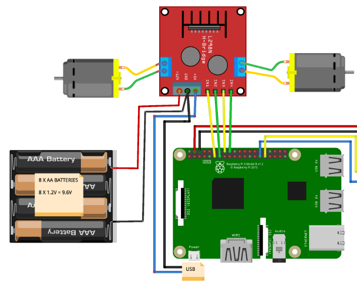
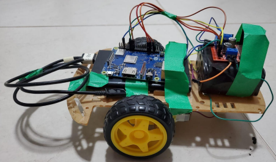

# mqtt-car

Prototype of a mobile robot controlled through MQTT ("Message Queuing Telemetry Transport"), a communication protocol. 

Material used:
- 2WD chassis kit;
- 2 DC motors;
- Raspberry Pi 3;
- Driver L298N;
- Power bank.

Programming languages: Python.

Area: Internet of Things (IOT).

## Goal
Use a raspberry PI to control a robot that receives locomotion commands through the MQTT protocol. 

The commands are: left, right, forward, back and stop.

The broker used for this project was [Test Mosquitto](https://test.mosquitto.org/).

## Hardware
The hardware structure:

The assembled mobile robot structure:

## Project structure
- mqtt.py: the code that connects the raspberry to the broker and waits for the received message.
- carwalk.py: code that has the functions for the robot's locomotion.

To run this project, only run the **mqtt.py** file.